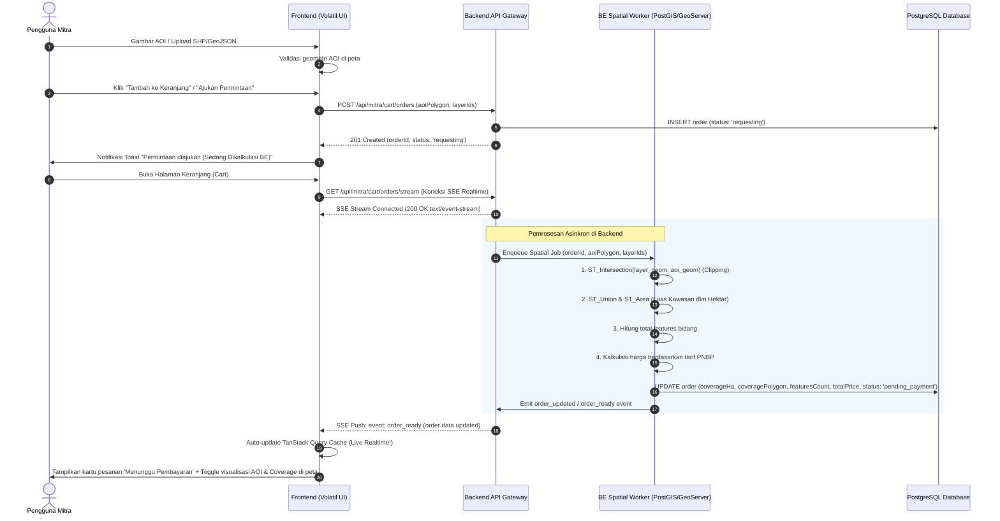

# Laporan & Panduan Handover Backend (BE): Alur Permintaan Data Berbasis AOI & Order Lifecycle 'requesting'

Dokumen ini berisi panduan teknis, spesifikasi API, dan kontrak interoperabilitas spasial untuk tim **Backend (BE)** mengenai perubahan alur **Permintaan Data (Data Request)** spasial menjadi **berbasis AOI (Area of Interest)** dengan *offloading* kalkulasi ke server.

---

## 1. Ringkasan Perubahan Arsitektur

### Sebelum Perubahan (Legacy FE Calculation):
- Frontend (browser) mengunduh seluruh fitur WFS dari GeoServer, menjalankan Web Worker lokal (Turf.js) untuk memotong (*clipping*) geometri dan menggabungkan (*unary union*) poligon, menghitung luas hektar dan total bidang di browser, lalu mengirimkan hasil kalkulasi final ke backend.
- **Kelemahan**: Membebani memori browser pengguna, rentan *crash* pada area besar (ribuan vertex/fitur), dan tidak aman dari manipulasi kalkulasi biaya di sisi *client*.

### Sesudah Perubahan (Backend-Driven Spatial Processing):
- Seluruh permintaan data diwajibkan berbasis **AOI (Area of Interest)**, baik melalui **Upload AOI** (`upload_aoi`) maupun **Gambar AOI** (`draw_aoi`). Tab Katalog sementara di-*defer*.
- Frontend hanya bertugas memvalidasi dan mengirimkan **geometri AOI** (`aoiPolygon`) serta daftar layer IGT yang dipilih ke endpoint `POST /api/mitra/cart/orders`.
- Backend segera membuat data pesanan (order) dengan status awal **`requesting`** dan mengembalikan respons HTTP `201 Created` ke Frontend.
- Kalkulasi berat (*spatial clipping*, *unary union* kawasan, hitung luas ha & jumlah bidang, penetapan harga PNBP) diproses secara asinkron di **Backend**.
- Data order langsung masuk ke **Keranjang (Cart)**. Di Keranjang, kartu pesanan menampilkan status *live* dan menyediakan kontrol *toggle* untuk melihat polygon **AOI** dan polygon **Coverage Area** hasil kalkulasi pada peta.

---

## 2. Diagram Alur Sistem (Sequence Diagram)



---

## 3. Spesifikasi Endpoint & Kontrak Payload

### 3.1 Pembuatan Order Permintaan Data
- **Endpoint**: `POST /api/mitra/cart/orders`
- **Akses**: `Mitra Only`
- **Header**:
  - `Content-Type: application/json`
  - `Authorization: Bearer <accessToken>` atau Cookie Session

#### Request Body (`AddToCartOrderRequest`):
```json
{
  "selectionType": "upload_aoi",
  "aoiPolygon": {
    "type": "Polygon",
    "coordinates": [
      [
        [106.815, -6.175],
        [106.835, -6.175],
        [106.835, -6.195],
        [106.815, -6.195],
        [106.815, -6.175]
      ]
    ]
  },
  "cqlFilter": "INTERSECTS(geom, POLYGON((106.815 -6.175, 106.835 -6.175, 106.835 -6.195, 106.815 -6.195, 106.815 -6.175)))",
  "items": [
    {
      "sourceLayerId": "geonode:bidang_tanah_rdtr"
    },
    {
      "sourceLayerId": "geonode:kawasan_lindung_geologi"
    }
  ]
}
```

#### Response Success (`201 Created`):
```json
{
  "success": true,
  "data": {
    "orderId": "ord-2026-0921-0089",
    "status": "requesting",
    "estimatedTotalPrice": 0,
    "createdAt": "2026-09-21T10:45:00.000Z"
  }
}
```

---

### 3.2 List Order di Keranjang
- **Endpoint**: `GET /api/mitra/cart/orders`
- **Akses**: `Mitra Only`

#### Response Success (`200 OK`):
```json
{
  "success": true,
  "data": {
    "orders": [
      {
        "orderId": "ord-2026-0921-0089",
        "status": "requesting",
        "selectionType": "upload_aoi",
        "createdAt": "2026-09-21T10:45:00.000Z",
        "aoiPolygon": {
          "type": "Polygon",
          "coordinates": [
            [
              [106.815, -6.175],
              [106.835, -6.175],
              [106.835, -6.195],
              [106.815, -6.195],
              [106.815, -6.175]
            ]
          ]
        },
        "coveragePolygon": null,
        "coverageHa": 0,
        "featuresCount": 0,
        "totalPrice": 0,
        "items": [
          {
            "id": "coi-001",
            "sourceLayerId": "geonode:bidang_tanah_rdtr",
            "sourceLayerTitle": "Bidang Tanah RDTR Perkotaan",
            "spatialBasis": "bidang",
            "featuresCount": 0,
            "unitPrice": 50000,
            "subtotalPrice": 0
          },
          {
            "id": "coi-002",
            "sourceLayerId": "geonode:kawasan_lindung_geologi",
            "sourceLayerTitle": "Kawasan Lindung Geologi Nasional",
            "spatialBasis": "kawasan",
            "featuresCount": 0,
            "areaHa": 0,
            "unitPrice": 50000,
            "subtotalPrice": 0
          }
        ]
      }
    ],
    "total": 1
  }
}
```

*Catatan: Setelah pemrosesan selesai oleh Backend, field `status` berubah menjadi `"pending_payment"`, `coveragePolygon` terisi GeoJSON poligon batas luar hasil clipping, `coverageHa` terisi luas hektar riil, `featuresCount` terisi kuantitas bidang riil, dan `totalPrice` terisi total nominal tarif.*

---

### 3.3 Real-Time SSE Stream Keranjang (Server-Sent Events)
Untuk memberikan pengalaman pengguna yang mulus tanpa perlu *polling* berkala, Backend menyediakan saluran *Server-Sent Events* (SSE) guna menyiarkan pembaruan status dan kalkulasi pesanan secara instan ke Frontend.

- **Endpoint**: `GET /api/mitra/cart/orders/stream`
- **Akses**: `Mitra Only`
- **Protocol**: `text/event-stream`
- **Header Response**:
  - `Content-Type: text/event-stream`
  - `Cache-Control: no-cache`
  - `Connection: keep-alive`
- **Autentikasi**: Query param `?token=<jwt_token>` (karena browser EventSource native tidak mendukung custom header `Authorization`).

#### Spesifikasi Event SSE:

| Event Name | Kapan Diterbitkan? | Deskripsi Payload |
| :--- | :--- | :--- |
| `order_created` | Saat order baru berhasil dimasukkan ke keranjang | `{ "type": "order_created", "orderId": string, "order": CartOrder }` |
| `order_calculating` | Saat proses clipping/union sedang berjalan di worker | `{ "type": "order_calculating", "orderId": string, "progress": number, "message": string }` |
| `order_ready` / `order_updated` | Saat kalkulasi selesai dan order siap dibayar (`pending_payment`) | `{ "type": "order_ready", "orderId": string, "order": CartOrder }` |
| `order_cancelled` | Saat order dibatalkan oleh user atau kalkulasi gagal | `{ "type": "order_cancelled", "orderId": string, "message": string }` |
| `heartbeat` | Setiap 15–30 detik (Keepalive ping) | `: ping\n\n` atau `{ "type": "heartbeat", "timestamp": string }` |

#### Contoh Aliran Stream SSE dari Backend:
```http
HTTP/1.1 200 OK
Content-Type: text/event-stream
Cache-Control: no-cache
Connection: keep-alive

: ping

event: order_calculating
data: {"type":"order_calculating","orderId":"ord-2026-0921-0089","progress":45,"message":"Memotong layer spasial kawasan dan menghitung luas tutupan..."}

event: order_ready
data: {"type":"order_ready","orderId":"ord-2026-0921-0089","order":{"orderId":"ord-2026-0921-0089","status":"pending_payment","selectionType":"upload_aoi","coverageHa":124.5,"featuresCount":42,"totalPrice":2100000,"coveragePolygon":{"type":"Polygon","coordinates":[[[106.815,-6.175],[106.835,-6.175],[106.835,-6.195],[106.815,-6.195],[106.815,-6.175]]]},"createdAt":"2026-09-21T10:45:00.000Z"},"timestamp":"2026-09-21T10:45:03.500Z"}
```

---

## 4. Algoritma Pemrosesan Spasial di Backend (PostGIS Implementation)

Untuk memproses setiap item layer dalam order, Backend disarankan menggunakan query spasial PostGIS berikut:

### A. Layer Berbasis Bidang Tanah (`spatialBasis: "bidang"`):
1. **Hitung jumlah fitur yang beririsan dengan AOI**:
```sql
SELECT COUNT(*) AS total_bidang
FROM master_layer_bidang
WHERE ST_Intersects(geom, ST_SetSRID(ST_GeomFromGeoJSON(:aoiGeoJson), 4326));
```
2. **Subtotal Harga**: `total_bidang * unit_price` (sesuai tarif PNBP).

### B. Layer Berbasis Kawasan (`spatialBasis: "kawasan"`):
1. **Potong fitur kawasan ke batas AOI (*Clipping*) dan lakukan *Unary Union* untuk batas cakupan**:
```sql
WITH clipped AS (
  SELECT ST_Intersection(geom, ST_SetSRID(ST_GeomFromGeoJSON(:aoiGeoJson), 4326)) AS geom
  FROM master_layer_kawasan
  WHERE ST_Intersects(geom, ST_SetSRID(ST_GeomFromGeoJSON(:aoiGeoJson), 4326))
),
unioned AS (
  SELECT ST_Union(geom) AS geom_union
  FROM clipped
)
SELECT 
  ST_AsGeoJSON(geom_union) AS coverage_geojson,
  (ST_Area(geom_union::geography) / 10000.0) AS coverage_ha
FROM unioned;
```
2. **Subtotal Harga**: `CEIL(coverage_ha) * unit_price_per_ha` (atau pembulatan sesuai regulasi PP PNBP).

---

## 5. Lifecycle Status Pesanan (`OrderStatus`)

```
[ POST /api/mitra/cart/orders ]
             │
             ▼
        'requesting'  <── (Initial state saat order baru diterima)
             │
             ├── (Kalkulasi Berhasil) ────────► 'pending_payment' ──► 'paid' ──► 'processing' ──► 'ready'
             │                                        │
             └── (Memerlukan Verifikasi Manual) ──────► 'pending_review' ──► 'approved' / 'rejected'
```

1. **`requesting`**: Order telah dibuat, kalkulasi *clipping*, *coverage area*, dan estimasi tarif sedang berjalan di BE.
2. **`pending_payment`**: Kalkulasi selesai, total tagihan terbit, mitra dapat melakukan *checkout* (menerbitkan kode billing Simponi).
3. **`pending_review`**: Jika pembelian melebihi *Purchase Limit* atau aturan khusus sehingga membutuhkan persetujuan Admin Internal.
4. **`rejected`**: Permintaan ditolak (misalnya area di luar wilayah operasional atau data tidak valid).

---

## 6. Harapan & Integrasi Visualisasi Peta (Frontend)

Frontend telah dilengkapi *layer management* otomatis:
- **AOI Polygon (`aoiPolygon`)**: Ditampilkan pada peta dengan warna oranye (`#f97316`) atau biru (`#3b82f6`).
- **Coverage Polygon (`coveragePolygon`)**: Ditampilkan pada peta dengan warna hijau emerald (`#10b981`) di atas poligon AOI.
- **Interaktivitas**: Mitra dapat menekan tombol *toggle* mata (*Eye Icon*) dan tombol *Focus/Zoom* (*Focus Icon*) pada kartu pesanan keranjang untuk memeriksa area yang akan dibeli secara visual.
- **SSE Stream Listener**: Frontend otomatis terhubung ke `GET /api/mitra/cart/orders/stream` untuk memperbarui antarmuka dan memunculkan polygon hasil secara *live* segera setelah BE selesai menghitung.
- **Route Cleanup**: Seluruh layer spasial otomatis dihapus bersih (*cleaned up*) dari instans MapLibre saat mitra berpindah halaman/rute.

---

## 7. Checklist Verifikasi Backend

- [ ] Endpoint `POST /api/mitra/cart/orders` menerima payload `aoiPolygon` dan mengembalikan status `"requesting"`.
- [ ] Worker asinkron memproses *clipping* PostGIS dan menghitung luas `coverageHa` & jumlah `featuresCount`.
- [ ] Endpoint `GET /api/mitra/cart/orders` mengembalikan data order lengkap beserta `aoiPolygon` dan `coveragePolygon`.
- [ ] Endpoint SSE `GET /api/mitra/cart/orders/stream` mengalirkan event `order_ready` saat kalkulasi selesai.
- [ ] Transisi status otomatis dari `"requesting"` ke `"pending_payment"` setelah kalkulasi selesai.
