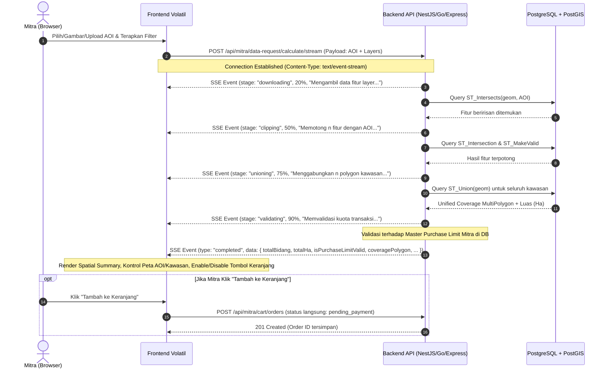

# Spesifikasi Teknis Backend (BE Handoff Guide)
# PostGIS Spatial Calculation & Streaming API
**Path Endpoint**: `POST /api/mitra/data-request/calculate/stream`  
**Target Backend**: PostgreSQL + PostGIS (v3.0+) | NestJS / Express / Go / FastAPI

---

## 1. Ringkasan Eksekutif & Alur Sistem

Sistem migrasi ini memindahkan komputasi spasial (*spatial clipping*, *ST_Union* pada kawasan, penghitungan hektar & jumlah bidang, serta validasi kuota *purchase limit*) dari browser pengguna (Turf.js) ke **PostgreSQL + PostGIS**.

Frontend berkomunikasi dengan Backend menggunakan protokol **HTTP POST dengan Server-Sent Events (SSE) Stream (`text/event-stream`)** untuk menampilkan progress step-by-step secara real-time.



---

## 2. Spesifikasi Endpoint

- **Method & Path**: `POST /api/mitra/data-request/calculate/stream`
- **Autentikasi**: `Bearer Token` (Header `Authorization: Bearer <jwt_token>` atau Session Cookie)
- **Role**: `mitra`
- **Request Headers**:
  - `Content-Type: application/json`
  - `Accept: text/event-stream`
- **Response Headers**:
  - `Content-Type: text/event-stream; charset=utf-8`
  - `Cache-Control: no-cache, no-transform`
  - `Connection: keep-alive`
  - `X-Accel-Buffering: no` *(Wajib untuk Nginx / Cloudflare agar stream tidak di-buffer)*

---

## 3. Request Payload (Input DTO)

```json
{
  "selectionType": "catalog",
  "cqlFilter": "INTERSECTS(geom, POLYGON((110.42 -7.02, 110.45 -7.02, 110.45 -7.05, 110.42 -7.05, 110.42 -7.02)))",
  "aoiPolygon": {
    "type": "Polygon",
    "coordinates": [
      [
        [110.42, -7.02],
        [110.45, -7.02],
        [110.45, -7.05],
        [110.42, -7.05],
        [110.42, -7.02]
      ]
    ]
  },
  "layers": [
    {
      "layerId": "persil_tanah_semarang",
      "typeName": "bpn:persil_tanah",
      "title": "Bidang Tanah Terdaftar",
      "spatialBasis": "bidang",
      "cqlFilter": "INTERSECTS(geom, POLYGON((110.42 -7.02, ...)))"
    },
    {
      "layerId": "rdtr_kawasan_lindung",
      "typeName": "bpn:rdtr_lindung",
      "title": "RDTR Kawasan Lindung",
      "spatialBasis": "kawasan",
      "cqlFilter": "INTERSECTS(geom, POLYGON((110.42 -7.02, ...)))"
    }
  ],
  "administrativeFilter": {
    "kodeProvinsi": "33",
    "kodeKabupaten": "3374",
    "kodeKecamatan": "337401",
    "kodeDesa": "3374011001"
  }
}
```

### Penjelasan Field:
| Field | Tipe | Keterangan |
| :--- | :--- | :--- |
| `selectionType` | `string` | `"catalog"` \| `"upload_aoi"` \| `"draw_aoi"` |
| `aoiPolygon` | `GeoJSON.Polygon` \| `GeoJSON.MultiPolygon` | Geometri AOI dalam koordinat EPSG:4326 `[longitude, latitude]`. |
| `cqlFilter` | `string` (opsional) | Klausa CQL filter yang aktif. |
| `layers` | `Array<LayerItem>` | Daftar layer yang dievaluasi perhitungannya. |
| `layers[].layerId` | `string` | ID layer sumber. |
| `layers[].typeName` | `string` | Nama feature type GeoServer (contoh: `bpn:persil_tanah`). |
| `layers[].spatialBasis` | `string` | `"bidang"` (dihitung per unit persil) atau `"kawasan"` (dihitung per luas hektar). |

---

## 4. Protokol Server-Sent Events (SSE Stream)

Format setiap event yang di-flush ke socket HTTP adalah:
```text
data: {"type": "progress", ...}\n\n
```

### A. Event: Progress (`type: "progress"`)
Backend mengirimkan event ini pada setiap transisi tahapan pemrosesan:

#### 1. Stage Downloading (`stage: "downloading"`)
```json
{
  "type": "progress",
  "stage": "downloading",
  "percentage": 15,
  "message": "Mengunduh 2 layer data spasial dari GeoServer...",
  "currentLayerIndex": 1,
  "totalLayers": 2
}
```

#### 2. Stage Clipping (`stage: "clipping"`)
```json
{
  "type": "progress",
  "stage": "clipping",
  "percentage": 45,
  "message": "Memotong 150 fitur spasial terhadap polygon AOI...",
  "processedFeatures": 150,
  "totalFeatures": 150
}
```

#### 3. Stage Unioning (`stage: "unioning"`)
```json
{
  "type": "progress",
  "stage": "unioning",
  "percentage": 75,
  "message": "Menggabungkan (ST_Union) 12 polygon kawasan beririsan...",
  "processedFeatures": 12,
  "totalFeatures": 12
}
```

#### 4. Stage Validating (`stage: "validating"`)
```json
{
  "type": "progress",
  "stage": "validating",
  "percentage": 90,
  "message": "Memvalidasi kuota dan batas pembelian akun mitra..."
}
```

---

### B. Event: Completed (`type: "completed"`)
Dikirim sebagai event akhir sebelum stream ditutup:

```json
{
  "type": "completed",
  "data": {
    "totalBidangCount": 134,
    "totalKawasanCount": 8,
    "totalKawasanAreaHa": 45.82,
    "subtotalBidangPrice": 6700000,
    "subtotalKawasanPrice": 13746000,
    "estimatedTotalPrice": 20446000,
    "isPurchaseLimitValid": true,
    "purchaseLimitMessage": null,
    "coveragePolygon": {
      "type": "MultiPolygon",
      "coordinates": [
        [
          [
            [110.425, -7.025],
            [110.445, -7.025],
            [110.445, -7.045],
            [110.425, -7.045],
            [110.425, -7.025]
          ]
        ]
      ]
    },
    "items": [
      {
        "sourceLayerId": "persil_tanah_semarang",
        "sourceLayerTitle": "Bidang Tanah Terdaftar",
        "spatialBasis": "bidang",
        "featuresCount": 134,
        "areaHa": 0,
        "unitPrice": 50000,
        "subtotalPrice": 6700000
      },
      {
        "sourceLayerId": "rdtr_kawasan_lindung",
        "sourceLayerTitle": "RDTR Kawasan Lindung",
        "spatialBasis": "kawasan",
        "featuresCount": 8,
        "areaHa": 45.82,
        "unitPrice": 300000,
        "subtotalPrice": 13746000
      }
    ]
  }
}
```

---

### C. Event: Completed Namun Melebihi Kuota (`isPurchaseLimitValid: false`)
Jika permohonan melebihi kuota akun mitra, status tetap `completed`, namun `isPurchaseLimitValid: false`:

```json
{
  "type": "completed",
  "data": {
    "totalBidangCount": 3500,
    "totalKawasanCount": 24,
    "totalKawasanAreaHa": 850.25,
    "subtotalBidangPrice": 175000000,
    "subtotalKawasanPrice": 255075000,
    "estimatedTotalPrice": 430075000,
    "isPurchaseLimitValid": false,
    "purchaseLimitMessage": "Permohonan luas kawasan (850.25 ha) melebihi batas kuota transaksi Anda (maks. 500.00 ha per transaksi). Silakan perkecil area AOI.",
    "coveragePolygon": { "type": "MultiPolygon", "coordinates": [...] },
    "items": [...]
  }
}
```

---

### D. Event: Error (`type: "error"`)
```json
{
  "type": "error",
  "message": "Geometri AOI tidak valid atau gagal melakukan spatial intersection pada database spasial."
}
```

---

## 5. Implementasi Query PostGIS

### 1. Validasi & Standarisasi AOI
Selalu bungkus input GeoJSON AOI dengan `ST_MakeValid` dan paksa ke koordinat SRID 4326:
```sql
-- Parameter $1 = GeoJSON string dari req.body.aoiPolygon
WITH aoi_input AS (
  SELECT ST_MakeValid(ST_SetSRID(ST_GeomFromGeoJSON($1), 4326)) AS geom
)
```

### 2. Spatial Clipping & Perhitungan Luas (Hektar)
Untuk menghitung irisan dan luas dalam hektar, konversikan geometri ke tipe `geography` (agar perhitungan geodesik akurat dalam meter persegi) lalu bagi `10000.0`:
```sql
WITH aoi AS (
  SELECT ST_MakeValid(ST_SetSRID(ST_GeomFromGeoJSON($1), 4326)) AS geom
),
clipped_features AS (
  SELECT
    f.id,
    f.spatial_basis,
    ST_CollectionExtract(
      ST_MakeValid(ST_Intersection(f.geom, aoi.geom)),
      3 -- 3 = Hanya ekstrak Poligon / MultiPoligon (mengabaikan titik/garis batas)
    ) AS clipped_geom
  FROM target_layer_table f, aoi
  WHERE ST_Intersects(f.geom, aoi.geom)
)
SELECT
  id,
  spatial_basis,
  ST_AsGeoJSON(clipped_geom)::json AS geometry,
  CASE 
    WHEN spatial_basis = 'kawasan' THEN 
      ROUND((ST_Area(clipped_geom::geography) / 10000.0)::numeric, 4)
    ELSE 0 
  END AS area_ha
FROM clipped_features
WHERE NOT ST_IsEmpty(clipped_geom);
```

### 3. Agregasi Kawasan (`ST_Union`)
Untuk menggabungkan seluruh fitur kawasan yang terpotong menjadi 1 polygon/multipolygon utuh:
```sql
WITH aoi AS (
  SELECT ST_MakeValid(ST_SetSRID(ST_GeomFromGeoJSON($1), 4326)) AS geom
),
kawasan_clipped AS (
  SELECT 
    ST_CollectionExtract(
      ST_MakeValid(ST_Intersection(k.geom, aoi.geom)),
      3
    ) AS geom
  FROM kawasan_layer_table k, aoi
  WHERE ST_Intersects(k.geom, aoi.geom)
),
unioned AS (
  SELECT ST_UnaryUnion(ST_Collect(geom)) AS unified_geom
  FROM kawasan_clipped
  WHERE NOT ST_IsEmpty(geom)
)
SELECT
  ST_AsGeoJSON(ST_Multi(unified_geom))::json AS coverage_polygon,
  ROUND((ST_Area(unified_geom::geography) / 10000.0)::numeric, 4) AS total_kawasan_area_ha
FROM unioned;
```

---

## 6. Contoh Kode Implementasi Backend

### Contoh Controller & Service (NestJS / Express)

```typescript
import { Controller, Post, Body, Res, Req, UseGuards } from '@nestjs/common';
import { Response, Request } from 'express';

@Controller('api/mitra/data-request')
export class SpatialCalculationController {
  constructor(private readonly spatialCalcService: SpatialCalculationService) {}

  @Post('calculate/stream')
  async calculateStream(
    @Body() dto: CalculateSpatialCoverageDto,
    @Req() req: Request,
    @Res() res: Response,
  ) {
    // 1. Set headers untuk Server-Sent Events
    res.setHeader('Content-Type', 'text/event-stream');
    res.setHeader('Cache-Control', 'no-cache, no-transform');
    res.setHeader('Connection', 'keep-alive');
    res.setHeader('X-Accel-Buffering', 'no');
    res.flushHeaders();

    const sendEvent = (event: any) => {
      res.write(`data: ${JSON.stringify(event)}\n\n`);
    };

    try {
      const user = req.user; // Mitra authenticated

      // 2. Stage Downloading
      sendEvent({
        type: 'progress',
        stage: 'downloading',
        percentage: 20,
        message: `Memeriksa ${dto.layers.length} layer spasial di database...`,
        totalLayers: dto.layers.length,
      });

      // 3. Stage Clipping
      sendEvent({
        type: 'progress',
        stage: 'clipping',
        percentage: 50,
        message: 'Melakukan pemotongan spasial (ST_Intersection) terhadap AOI...',
      });

      const { bidangCount, kawasanFeatures, subtotalBidang } =
        await this.spatialCalcService.processClipping(dto);

      // 4. Stage Unioning
      sendEvent({
        type: 'progress',
        stage: 'unioning',
        percentage: 75,
        message: 'Menggabungkan geometri kawasan (ST_Union)...',
      });

      const { coveragePolygon, totalKawasanHa, subtotalKawasan } =
        await this.spatialCalcService.processUnion(kawasanFeatures, dto.aoiPolygon);

      // 5. Stage Validating
      sendEvent({
        type: 'progress',
        stage: 'validating',
        percentage: 90,
        message: 'Memvalidasi kuota dan batas pembelian akun mitra...',
      });

      const estimatedTotal = subtotalBidang + subtotalKawasan;
      const limitValidation = await this.spatialCalcService.validatePurchaseLimit(
        user.id,
        bidangCount,
        totalKawasanHa,
        estimatedTotal,
      );

      // 6. Stage Completed
      sendEvent({
        type: 'completed',
        data: {
          totalBidangCount: bidangCount,
          totalKawasanCount: kawasanFeatures.length,
          totalKawasanAreaHa: totalKawasanHa,
          subtotalBidangPrice: subtotalBidang,
          subtotalKawasanPrice: subtotalKawasan,
          estimatedTotalPrice: estimatedTotal,
          isPurchaseLimitValid: limitValidation.isValid,
          purchaseLimitMessage: limitValidation.message,
          coveragePolygon: coveragePolygon,
          items: [
            // List item detail...
          ],
        },
      });

      res.write('data: [DONE]\n\n');
      res.end();
    } catch (error: any) {
      sendEvent({
        type: 'error',
        message: error.message || 'Terjadi kesalahan pada kalkulasi PostGIS',
      });
      res.end();
    }
  }
}
```

---

## 7. Aturan Validasi Purchase Limit

Backend wajib membandingkan hasil kalkulasi dengan konfigurasi akun mitra:

```typescript
type PurchaseLimitPolicy = {
  maxBidangPerOrder: number;      // e.g. 1000 bidang
  maxKawasanHaPerOrder: number;   // e.g. 500.00 ha
  maxOrderAmount: number;         // e.g. Rp 100.000.000
};

function validateLimit(policy: PurchaseLimitPolicy, bidang: number, kawasanHa: number, totalAmount: number) {
  if (bidang > policy.maxBidangPerOrder) {
    return {
      isValid: false,
      message: `Jumlah bidang (${bidang}) melebihi kuota maksimum per transaksi (${policy.maxBidangPerOrder} bidang).`,
    };
  }
  if (kawasanHa > policy.maxKawasanHaPerOrder) {
    return {
      isValid: false,
      message: `Luas kawasan (${kawasanHa.toFixed(2)} ha) melebihi batas kuota transaksi (${policy.maxKawasanHaPerOrder.toFixed(2)} ha).`,
    };
  }
  if (totalAmount > policy.maxOrderAmount) {
    return {
      isValid: false,
      message: `Estimasi biaya transaksi melebihi batas per transaksi.`,
    };
  }
  return { isValid: true, message: null };
}
```

---

## 8. Alur Penyimpanan ke Keranjang (`POST /api/mitra/cart/orders`)

Ketika mitra mengklik tombol *"Tambah ke Keranjang"*, Frontend akan mengirim:
```json
{
  "selectionType": "catalog",
  "aoiPolygon": { "type": "Polygon", "coordinates": [...] },
  "coveragePolygon": { "type": "MultiPolygon", "coordinates": [...] },
  "cqlFilter": "INTERSECTS(geom, ...)",
  "items": [
    { "sourceLayerId": "persil_tanah_semarang", "cqlFilter": "..." },
    { "sourceLayerId": "rdtr_kawasan_lindung", "cqlFilter": "..." }
  ]
}
```
Backend **langsung menyimpan** order ke tabel transaksi dengan status **`pending_payment`** tanpa perlu komputasi ulang karena validasi kuota telah lolos di tahap perhitungan awal.
