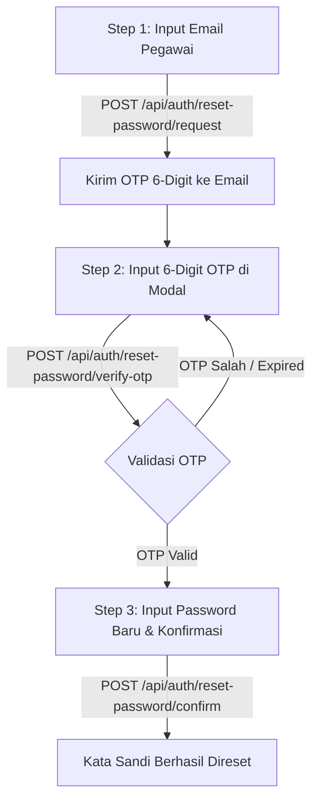

# Dokumentasi & Spesifikasi Modul Reset Password (Khusus Internal ATR/BPN)

Dokumen ini ditujukan untuk **Tim Backend (BE)** sebagai panduan implementasi endpoint API untuk modul **Reset Password Akun Internal** pada sistem IGTPR Volatil.

---

## 1. Ikhtisar & Arsitektur Alur (Flow)

Modul reset kata sandi menggunakan alur terpadu **3-Step OTP Verification Flow**:



Baik saat dipanggil dari **Form Signin Internal (Lupa Password)** maupun dari **User Profile Popover**, alur verifikasinya adalah sama dan seragam demi keamanan.

---

## 2. Rincian Endpoint API

### 2.1 Step 1: Request Kode OTP

Digunakan untuk meminta pengiriman kode OTP 6-digit ke email akun internal.

- **Method**: `POST`
- **Path**: `/api/auth/reset-password/request`
- **Akses**: `Public / Authenticated`
- **Rate Limit Disarankan**: Max 3 request per 15 menit per email / IP
- **Content-Type**: `application/json`

#### Request Payload
```json
{
  "email": "pegawai@atrbpn.go.id"
}
```

#### Response Sukses (200 OK)
```json
{
  "success": true,
  "message": "Kode verifikasi reset kata sandi telah dikirim ke email Anda.",
  "data": {
    "email": "pegawai@atrbpn.go.id",
    "expiresIn": 300
  }
}
```

#### Skenario Error:
- **404 Not Found / 400 Bad Request** (Email bukan akun internal / tidak terdaftar):
```json
{
  "success": false,
  "message": "Email tidak terdaftar sebagai akun internal."
}
```
- **429 Too Many Requests** (Rate limit terlampaui):
```json
{
  "success": false,
  "message": "Terlalu banyak permintaan reset kata sandi. Silakan tunggu beberapa saat lagi."
}
```

---

### 2.2 Step 2: Verifikasi Kode OTP

Digunakan untuk memvalidasi kode OTP 6 digit yang dimasukkan oleh pengguna sebelum pengguna mengisi password baru.

- **Method**: `POST`
- **Path**: `/api/auth/reset-password/verify-otp`
- **Akses**: `Public / Authenticated`
- **Content-Type**: `application/json`

#### Request Payload
```json
{
  "email": "pegawai@atrbpn.go.id",
  "resetToken": "123456"
}
```

#### Response Sukses (200 OK)
```json
{
  "success": true,
  "message": "Kode OTP valid.",
  "data": {
    "success": true,
    "message": "Kode OTP valid.",
    "email": "pegawai@atrbpn.go.id",
    "resetToken": "123456"
  }
}
```

#### Skenario Error:
- **400 Bad Request / 401 Unauthorized** (Kode salah / token expired):
```json
{
  "success": false,
  "message": "Kode OTP salah atau telah kedaluwarsa."
}
```

---

### 2.3 Step 3: Simpan Kata Sandi Baru

Digunakan untuk mengupdate kata sandi baru setelah OTP terverifikasi.

- **Method**: `POST`
- **Path**: `/api/auth/reset-password/confirm`
- **Akses**: `Public / Authenticated`
- **Content-Type**: `application/json`

#### Request Payload
```json
{
  "email": "pegawai@atrbpn.go.id",
  "resetToken": "123456",
  "newPassword": "PasswordBaru@123",
  "confirmPassword": "PasswordBaru@123"
}
```

#### Response Sukses (200 OK)
```json
{
  "success": true,
  "message": "Kata sandi akun Anda telah berhasil direset.",
  "data": {
    "success": true,
    "message": "Kata sandi akun Anda telah berhasil direset."
  }
}
```

#### Skenario Error:
- **400 Bad Request / 401 Unauthorized** (Token tidak valid / expired):
```json
{
  "success": false,
  "message": "Gagal mereset kata sandi. Kode verifikasi tidak valid atau kedaluwarsa."
}
```
- **422 Unprocessable Entity** (Panjang sandi kurang dari 8 karakter / konfirmasi tidak cocok):
```json
{
  "success": false,
  "message": "Konfirmasi kata sandi tidak sesuai dengan kata sandi baru."
}
```

---

## 3. Catatan Keamanan & Rekomendasi Teknis BE

1. **Format Token & Masa Berlaku OTP:**
   - Masa berlaku kode OTP adalah **5 menit (300 detik)**.
   - Format: 6 digit angka numerik.
   - Setiap kali kode berhasil digunakan atau expired, token harus di-invalidate (*one-time use*).
   - Batasi percobaan salah OTP max 5 kali per sesi OTP sebelum di-lock sementara.

2. **Validasi Role Akun:**
   - Endpoint memastikan bahwa akun yang direset memiliki `role: "internal"`.

3. **Hashing Kata Sandi:**
   - Gunakan algoritma hashing standar (Argon2id atau Bcrypt dengan salt rounds $\ge 10$).

4. **Invalidasi Sesi Aktif:**
   - Ketika kata sandi berhasil direset, cabut (*revoke*) semua session aktif / refresh token lama dari user tersebut.
