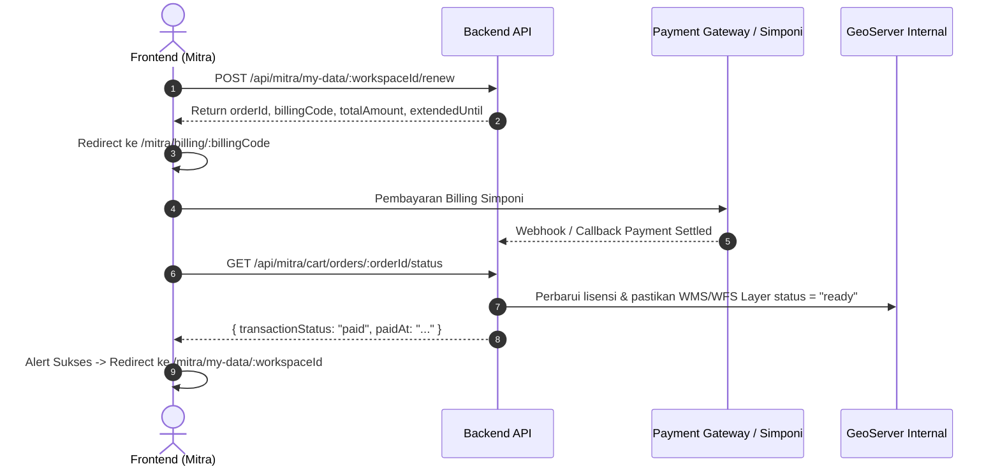

# Spesifikasi Integrasi Backend (BE) — Update Fitur Volatil

Dokumen ini ditujukan untuk tim Backend (BE) sebagai panduan penyesuaian API dan background job sehubungan dengan implementasi fitur terbaru di frontend Volatil:
1. **Notifikasi Peringatan Masa Aktif Layanan IGT Kedaluwarsa (H-7)**
2. **Interaktivitas Inbox & Deep Link ke Detail Workspace Data Saya**
3. **Alur Perpanjangan Layanan Workspace IGT (_Renew -> Bayar -> Aktif/Ready_)**
4. **Modul Master GeoServer (Source of Data): Uji Koneksi & Keamanan Kredensial**

---

## 1. Notifikasi Service Kedaluwarsa (H-7 Alert)

### 1.1. Mekanisme & Trigger (Cron Job)
- **Frekuensi Job**: Dijalankan setiap hari (rekomendasi: pukul 00:00 atau 06:00 WIB).
- **Kondisi Trigger**:
  - Workspace / Layer IGT mitra memiliki status `ready` atau `active`.
  - `expiresAt` tersisa antara **0 < `expiresAt - NOW()` <= 7 hari**.
  - Mitra belum menerima notifikasi peringatan H-7 untuk siklus kedaluwarsa yang sama (idempotent / flag `is_notified_h7 = true`).

### 1.2. Schema Payload Item Inbox (`GET /api/inbox`)
- **Kategori baru**: `"kedaluwarsa"`
- **Action URL**: `/mitra/my-data/:workspaceId`

```json
{
  "id": "inbox-ntf-20261005-001",
  "title": "Masa Aktif Service IGT Segera Berakhir",
  "message": "Layanan WMS/WFS untuk workspace Peta Bidang Tanah Kab. Bogor akan kedaluwarsa dalam 7 hari. Segera lakukan perpanjangan agar integrasi GIS Anda tidak terputus.",
  "category": "kedaluwarsa",
  "isRead": false,
  "createdAt": "2026-10-05T06:00:00Z",
  "actionUrl": "/mitra/my-data/ws_ord_20260829_003",
  "metadata": {
    "orderId": "ord_20260829_003",
    "workspaceId": "ws_ord_20260829_003",
    "expiresAt": "2026-10-12T23:59:59Z",
    "daysRemaining": 7
  }
}
```

---

## 2. Interaktivitas Inbox Notifikasi

### 2.1. Standarisasi `actionUrl` pada Semua Notifikasi
Frontend kini menjadikan seluruh kartu notifikasi di Inbox interaktif (dapat diklik langsung untuk mengarahkan pengguna ke halaman target terkait):

| Skenario Notifikasi | Kategori | Nilai `actionUrl` yang Diharapkan |
| :--- | :--- | :--- |
| Pembelian IGT Berhasil / Service Ready | `transaksi` / `sistem` | `/mitra/my-data/:workspaceId` |
| Peringatan Service Kedaluwarsa (H-7) | `kedaluwarsa` | `/mitra/my-data/:workspaceId` |
| Billing / Menunggu Pembayaran | `transaksi` | `/mitra/billing/:billingCode?orderId=:orderId` |
| Verifikasi Akun Mitra Disetujui | `sistem` | `/mitra/data-request` |

> [!NOTE]
> Jika notifikasi bersifat informatif umum tanpa halaman tujuan khusus, field `actionUrl` dapat diisi `null` atau dihilangkan.

---

## 3. Fitur Perpanjangan Layanan (_Workspace Renewal_)

Alur lengkap perpanjangan:


### 3.1. Endpoint Inisiasi Perpanjangan Layanan
**`POST /api/mitra/my-data/:workspaceId/renew`**

#### Headers:
```http
Authorization: Bearer <token_mitra>
Content-Type: application/json
```

#### Request Body:
```json
{
  "durationMonths": 12,
  "paymentMethod": "billing_simponi"
}
```

#### Response Body (`200 OK` / `201 Created`):
```json
{
  "success": true,
  "code": 200,
  "message": "Order perpanjangan layanan berhasil dibuat",
  "data": {
    "orderId": "ord-renew-ws_ord_20260829_003-1728100000",
    "orderNumber": "RNW-202610-0089",
    "billingCode": "820269182374",
    "totalAmount": 1500000,
    "expiresAt": "2026-10-12T23:59:59Z",
    "extendedUntil": "2027-10-12T23:59:59Z",
    "status": "pending_payment"
  }
}
```

### 3.2. Endpoint Cek Status Pembayaran Order
**`GET /api/mitra/cart/orders/:orderId/status`** (atau `/api/orders/:orderId/status`)

#### Response Body Saat Sudah Dibayar (`200 OK`):
```json
{
  "success": true,
  "code": 200,
  "message": "Status pembayaran berhasil diverifikasi",
  "data": {
    "orderId": "ord-renew-ws_ord_20260829_003-1728100000",
    "transactionStatus": "paid",
    "paidAt": "2026-10-05T06:15:30Z"
  }
}
```

### 3.3. Logika Update Data di Sisi Backend Saat Pembayaran Lunas
Saat status pembayaran renewal menjadi `"paid"`:
1. Perpanjang `expiresAt` pada tabel `mitra_workspaces` dan seluruh record `mitra_workspace_layers` terkait:
   $$\text{expiresAt Baru} = \max(\text{expiresAt Lama}, \text{NOW()}) + (\text{durationMonths} \times 30 \text{ hari})$$
2. Jika workspace sebelumnya berstatus `expired`, ubah kembali statusnya menjadi `ready` / `active`.
3. Pastikan API key dan endpoint proxy GeoServer untuk workspace tersebut tetap aktif tanpa mengubah URL atau format koneksi QGIS yang sudah dimiliki mitra.
4. Buat record faktur/invoice pembayaran baru di histori transaksi mitra.

---

## 4. Modul Master GeoServer (Source of Data)

### 4.1. Endpoint Uji Koneksi Server (*Test Connection*)
**`POST /api/internal/master-geoserver/test-connection`**

Frontend memanggil endpoint ini sebelum menyimpan server untuk memastikan instance GeoServer aktif dan kredensial valid.

#### Request Body:
```json
{
  "id": "geo-uuid-12345", 
  "baseUrl": "https://geoserver.atrbpn.go.id/geoserver",
  "username": "admin_spatial",
  "password": "rahasiaPassword123"
}
```
> **Catatan Kredensial & Mode Edit:**
> - `id` (*opsional*): Jika dikirim (pada form edit server), backend dapat mencari record GeoServer tersimpan di database.
> - Jika `id` ada dan `password` bernilai kosong / `undefined`, backend **wajib** menggunakan password tersimpan di database untuk melakukan uji koneksi (karena password tidak pernah dikirim ke frontend pada form edit demi keamanan).
> - Jika `password` diisi oleh user, backend menggunakan password baru tersebut.
> - Pada form tambah server baru (`Create`), parameter `id` tidak dikirim dan `password` wajib diisi.

#### Response Body Berhasil (`200 OK`):
```json
{
  "success": true,
  "code": 200,
  "message": "Koneksi ke instance GeoServer berhasil terverifikasi",
  "data": {
    "success": true,
    "message": "Koneksi ke instance GeoServer berhasil terverifikasi",
    "version": "GeoServer 2.24.2 (WFS 2.0.0 / WMS 1.3.0)",
    "latencyMs": 95,
    "workspacesCount": 8
  }
}
```

#### Response Body Gagal (`200 OK` / `400 Bad Request`):
```json
{
  "success": false,
  "code": 400,
  "message": "Gagal terhubung ke GeoServer: 401 Unauthorized (Username atau Password salah)",
  "data": {
    "success": false,
    "message": "401 Unauthorized"
  }
}
```

### 4.2. Keamanan Kredensial & Response Masking
1. **Password Write-Only**: Pada `GET /api/internal/master-geoserver` dan `GET /api/internal/master-geoserver/:id`, BE **DILARANG** mengembalikan plain text password. Field `password` pada response harus di-omit atau di-masking.
2. **Update Password Opsional**: Pada `PUT /api/internal/master-geoserver/:id`, jika field `password` tidak dikirim / bernilai `undefined`, Backend harus mempertahankan password lama di database.
3. **Field `isActive`**: Backend menyimpan status aktif boolean `isActive: true/false` pada record server.

---

## 5. Bounding Box Workspace (`bbox`) pada Detail & List Workspace

### 5.1. Kebutuhan & Perilaku Frontend
Ketika mitra membuka halaman detail workspace pada menu **Data Saya** (`/mitra/my-data/:workspaceId`), peta interaktif di sisi kiri secara otomatis mengarahkan kamera (*auto-fly & fit bounds*) ke batas wilayah spasial dari workspace tersebut.

Oleh karena itu, response detail workspace (dan list workspace) membutuhkan field `bbox`.

### 5.2. Format `bbox` Spasial
Field `bbox` menggunakan format array 4 elemen koordinat geografis **EPSG:4326 (WGS84)** dengan urutan **`[minLng, minLat, maxLng, maxLat]`** (*West, South, East, North*):

```json
"bbox": [115.083839, -8.850039, 115.251534, -8.239441]
```

### 5.3. Endpoint `GET /api/mitra/workspaces/:id`
Response detail workspace yang dikembalikan ke frontend:

```json
{
  "success": true,
  "code": 200,
  "message": "Detail workspace berhasil dimuat",
  "data": {
    "id": "ws_ord_20260830_001",
    "workspaceName": "ws_ord_20260830_001",
    "orderId": "ord-2026-0830-001",
    "orderNumber": "ORD-20260830-001",
    "transactionNumber": "TRX-20260830-001",
    "userId": 42,
    "status": "ready",
    "wmsUrl": "https://geoportal.atrbpn.go.id/interop/wms?workspace=ws_ord_20260830_001",
    "wfsUrl": "https://geoportal.atrbpn.go.id/interop/wfs?workspace=ws_ord_20260830_001",
    "qgisWmsUrl": "https://geoportal.atrbpn.go.id/interop/wms?workspace=ws_ord_20260830_001",
    "bbox": [115.083839, -8.850039, 115.251534, -8.239441],
    "layersCount": 2,
    "layers": [
      {
        "id": "testing_workspace:TEST_RTRW_BADUNG",
        "label": null,
        "title": "RTRW Badung",
        "spatialBasis": "kawasan",
        "wfsUrl": "/api/proxy/wfs?layerId=testing_workspace:TEST_RTRW_BADUNG",
        "wmsUrl": "/api/proxy/wms?layerId=testing_workspace:TEST_RTRW_BADUNG",
        "externalWmsUrl": "https://geoportal.atrbpn.go.id/interop/wms?workspace=ws_ord_20260830_001&layer=TEST_RTRW_BADUNG",
        "wfsTypeName": "testing_workspace:TEST_RTRW_BADUNG",
        "wmsLayers": "testing_workspace:TEST_RTRW_BADUNG",
        "status": "ready",
        "expiresAt": "2026-12-31T23:59:59.000Z",
        "bbox": [115.083839, -8.850039, 115.251389, -8.239441]
      }
    ],
    "createdAt": "2026-08-30T09:15:00.000Z",
    "expiresAt": "2026-12-31T23:59:59.000Z",
    "invoiceUrl": "https://volatil-be.exium.web.id/invoices/INV-2026-0825-001.pdf",
    "tteInvoiceUrl": "https://volatil-be.exium.web.id/invoices/TTE-INV-2026-0825-001.pdf",
    "tte": true
  }
}
```

### 5.4. Logika Penentuan `bbox` di Sisi Backend
Backend dapat menghitung nilai `bbox` workspace melalui salah satu cara berikut:
1. **Berdasarkan AOI Polygon Pesanan**: Menghitung bounding box dari geometri Polygon AOI yang digambar/dipilih mitra saat membuat order permohonan data.
2. **Union Bounding Box dari Layer**: Menghitung gabungan (*union extent*) dari `bbox` seluruh layer yang tergabung dalam workspace tersebut (`ST_Extent` / `ST_Envelope` pada PostGIS).

---

## 6. Checklist Ringkas untuk Tim BE

- [ ] Tambahkan enum/kategori `"kedaluwarsa"` pada tabel notifikasi.
- [ ] Buat cron job harian notifikasi H-7 masa kedaluwarsa dengan menyertakan `actionUrl: "/mitra/my-data/{workspaceId}"`.
- [ ] Implementasikan endpoint `POST /api/mitra/my-data/:workspaceId/renew`.
- [ ] Hubungkan webhook pembayaran Simponi/PG untuk mengeksekusi penambahan masa aktif `expiresAt` (+12 bulan) dan status workspace menjadi `ready`.
- [ ] Implementasikan endpoint `POST /api/internal/master-geoserver/test-connection`.
- [ ] Terapkan masking kredensial password pada endpoint `GET /api/internal/master-geoserver`.
- [ ] Sertakan field `bbox: [minLng, minLat, maxLng, maxLat]` pada endpoint `GET /api/mitra/workspaces/:id` dan `GET /api/mitra/workspaces`.

