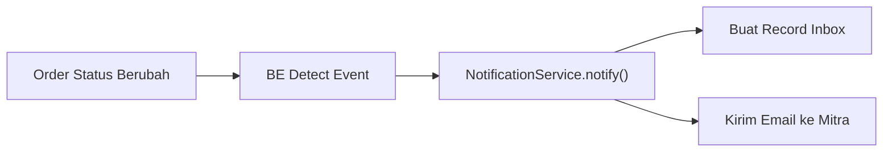
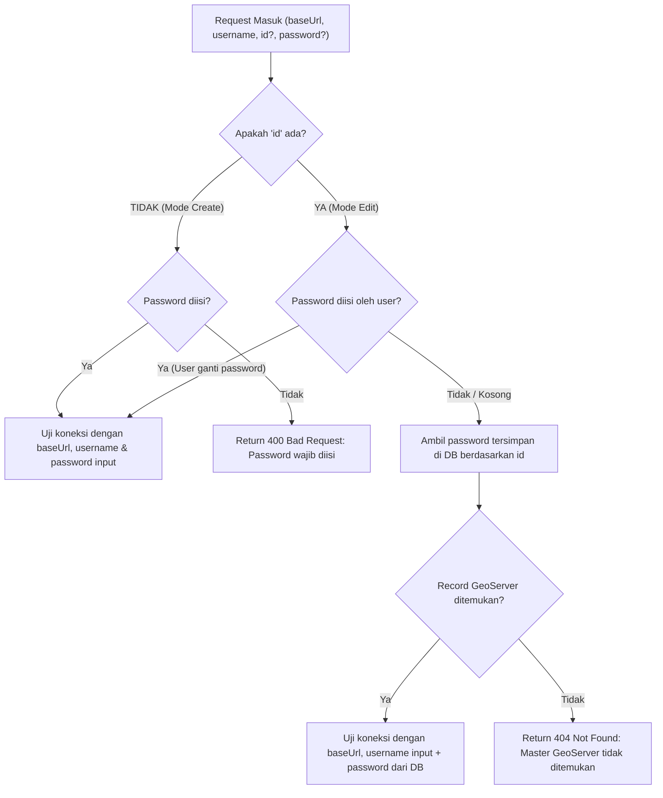

# Spesifikasi Integrasi Backend (BE) — Update Fitur Volatil

Dokumen ini merupakan panduan spesifikasi teknis lengkap untuk tim Backend (BE) dalam rangka pengembangan dan penyesuaian API, background job scheduler, notification service, modul master GeoServer, perbaikan layout generator PDF invoice, dan dukungan spasial bounding box (`bbox`).

---

## 1. Modul Notification & Inbox

### 1.1. Scope & Entity

Menyimpan dan mengambil notifikasi untuk pengguna (Mitra/Internal) dengan dukungan multi-channel terpusat (Inbox & Email).

**Entity / Tabel `notifications` (atau `inbox`):**

- `id` (UUID, Primary Key)
- `userId` (ID Pengguna penerima)
- `title` (String)
- `message` (Text)
- `category` (Enum / String: `"kedaluwarsa"` | `"transaksi"` | `"sistem"`)
- `isRead` (Boolean, default `false`)
- `actionUrl` (String, nullable — URL target navigasi di frontend, contoh: `/mitra/my-data/{workspaceId}`)
- `actionLabel` (String, nullable — contoh: `"Perpanjang Layanan"`, `"Lihat Detail"`)
- `metadata` (JSONB / Text nullable — menyimpan context seperti `workspaceId`, `orderId`, `daysRemaining`, dll.)
- `createdAt` (Timestamp with timezone)
- `readAt` (Timestamp with timezone, nullable)

### 1.2. Endpoint Inbox API

- **`GET /notifications`** : Mengambil daftar notifikasi milik pengguna yang sedang login (support pagination / sort by `createdAt DESC`).
- **`GET /notifications/unread-count`** : Mengambil jumlah notifikasi yang belum dibaca (`isRead = false`).
- **`PATCH /notifications/:id/read`** : Menandai satu notifikasi spesifik sebagai telah dibaca (`isRead = true`, set `readAt = NOW()`).
- **`PATCH /notifications/read-all`** : Menandai semua notifikasi milik pengguna sebagai telah dibaca.

> [!IMPORTANT]
> User hanya dapat mengakses dan memodifikasi notifikasi miliknya sendiri (filter otomatis berdasarkan `userId` dari token JWT autentikasi).

#### Contoh Response `GET /notifications`:

```json
{
  "success": true,
  "code": 200,
  "data": [
    {
      "id": "inbox-uuid-12345",
      "title": "Peringatan Masa Aktif: Sisa 1 Minggu (H-7)",
      "message": "Masa aktif layanan data spasial IGT pada workspace 'Workspace Bidang Tanah RTRW' akan kedaluwarsa dalam 7 hari (15 Okt 2026). Segera lakukan perpanjangan layanan untuk menjaga kelangsungan akses interoperabilitas WMS/WFS Anda.",
      "category": "kedaluwarsa",
      "isRead": false,
      "actionUrl": "/mitra/my-data/22a298d6-e948-49a7-a8ac-4374c3f3f063",
      "actionLabel": "Perpanjang Layanan",
      "metadata": {
        "workspaceId": "22a298d6-e948-49a7-a8ac-4374c3f3f063",
        "workspaceName": "Workspace Bidang Tanah RTRW",
        "orderId": "ord-20260830-001"
      },
      "createdAt": "2026-10-06T13:34:00Z",
      "readAt": null
    }
  ],
  "unreadCount": 1
}
```

---

## 2. Notifikasi Kedaluwarsa H-7 (Background Scheduler)

### 2.1. Scope & Trigger

Mengirimkan peringatan otomatis ketika masa aktif layanan data spasial IGT suatu workspace/service akan berakhir dalam 7 hari.

**Trigger Scheduler:**

1. Service/workspace memiliki field `expiresAt` (atau `expiredAt`).
2. Sistem mendeteksi kondisi **H-7** terhadap `expiresAt` ($0 < \text{expiresAt} - \text{NOW()} \le 7\text{ hari}$).
3. Scheduler mengecek dan memproses user/mitra terkait.
4. Membuat **1 Inbox Notification** dan mengirim **1 Email Notification** ke user.
5. Menyimpan metadata referensi resource (`workspaceId`, `orderId`, dll.).

```json
{
  "title": "Peringatan Masa Aktif: Sisa 1 Minggu (H-7)",
  "message": "Masa aktif layanan data spasial IGT pada workspace 'Workspace Bidang Tanah' akan kedaluwarsa dalam 7 hari (15 Okt 2026). Segera lakukan perpanjangan layanan untuk menjaga kelangsungan akses interoperabilitas WMS/WFS Anda.",
  "category": "kedaluwarsa",
  "actionUrl": "/mitra/my-data/{workspaceId}",
  "actionLabel": "Perpanjang Layanan",
  "metadata": {
    "workspaceId": "22a298d6-e948-49a7-a8ac-4374c3f3f063",
    "workspaceName": "Workspace Bidang Tanah RTRW",
    "orderId": "ord-20260830-001"
  }
}
```

### 2.2. Aturan Wajib H-7 & Siklus Perpanjangan

- **Tepat 1 Kali per Periode**: H-7 hanya dikirim 1 kali untuk setiap periode masa aktif layanan (1 Inbox + 1 Email).
- **Idempotency Scheduler**: Scheduler yang berjalan berkali-kali / retry job **TIDAK BOLEH** menghasilkan duplikasi notifikasi.
- **Siklus Renewal Baru**: Setelah layanan diperpanjang (_renewal_), `expiresAt` bergeser ke periode baru (contoh: +1 tahun). Periode baru ini berhak mendapatkan **1 kali kesempatan H-7 baru** saat mendekati tanggal kedaluwarsa yang baru.
- Notifikasi H-7 dari periode masa aktif yang lama tidak boleh dikirim ulang.
- Jika layanan sudah terlanjur kedaluwarsa atau sudah diperpanjang sebelum trigger H-7 terpicu, lewati pengiriman H-7 periode lama.

```
Expiry: 15 Okt 2026
        ↓
H-7: 8 Okt 2026 ───> Kirim 1 Inbox + 1 Email
        ↓
Scheduler 9 Okt  ───> SKIP (Idempotent)
Scheduler 10 Okt ───> SKIP (Idempotent)
...
        ↓
Perpanjangan (Renewal) Berhasil
        ↓
Expiry Baru: 15 Nov 2027
        ↓
H-7 Baru: 8 Nov 2027 ───> Kirim 1 Inbox + 1 Email Baru
```

---

## 3. Order Event Lifecycle ke Notifikasi

### 3.1. Flow Event

Setiap transisi status order yang memerlukan informasi ke pengguna wajib menghasilkan notifikasi Inbox dan Email melalui service terpusat:



### 3.2. Mapping Status / Event Order Existing

Gunakan status/enum order existing di Backend tanpa membuat status baru:

- `ORDER_CREATED`
- `ORDER_SUBMITTED`
- `PAYMENT_PENDING`
- `PAYMENT_CONFIRMED`
- `ORDER_PROCESSING`
- `ORDER_COMPLETED`
- `ORDER_REJECTED`
- `ORDER_FAILED`
- `ORDER_CANCELLED`

Setiap event wajib menyediakan: `title`, `message`, `category`, `actionUrl`, `actionLabel`, dan `metadata`.

---

## 4. Arsitektur Notification Service & Idempotency Key

### 4.1. Centralized Notification Service

```
NotificationService
├── createInbox()
├── sendEmail()
└── notify(user, notificationPayload)
        ├── create inbox
        └── send email
```

**Manfaat:**

- Format notifikasi seragam di seluruh channel.
- Logika pencegahan duplikasi (_duplicate prevention_) terkontrol di satu titik.
- Order service tidak perlu mengelola query database inbox secara manual.

### 4.2. Aturan Idempotency Key

Gunakan unique reference/event key pada tabel lock/log notifikasi:

- **Format Order Event**: `ORDER_{STATUS}:order:{orderId}:user:{userId}`  
  _Contoh:_ `ORDER_COMPLETED:order:ord-123:user-456`
- **Format H-7 Expiry**: `EXPIRING_7_DAYS:workspace:{workspaceId}:expiry-{YYYY-MM-DD}:user:{userId}`  
  _Contoh:_ `EXPIRING_7_DAYS:workspace:ws-123:expiry-2026-10-15:user-456`

> [!NOTE]
> Dengan menyertakan string tanggal expiry (`expiry-2026-10-15`) ke dalam key, ketika layanan diperpanjang dan memiliki tanggal expiry baru, key idempotency otomatis berubah sehingga H-7 periode baru tetap dapat terkirim saat waktunya tiba.

---

## 5. Master GeoServer: Uji Koneksi (_Test Connection_)

### 5.1. Endpoint Schema

**`POST /api/internal/master-geoserver/test-connection`**

#### Request Payload:

```typescript
{
  id?: string;          // UUID Master GeoServer (Wajib dikirim jika dari form EDIT)
  baseUrl: string;      // Base URL GeoServer
  username?: string;    // Username autentikasi GeoServer
  password?: string;    // Password (opsional jika dari form EDIT)
}
```

### 5.2. Logika Resolusi Kredensial di Backend:



### 5.3. Contoh Request & Response

#### A. Request dari Form Edit (Password tidak diubah):

```json
{
  "id": "7b8f9e0a-1234-4567-89ab-cdef01234567",
  "baseUrl": "https://geoserver.atrbpn.go.id/geoserver",
  "username": "admin_spatial"
}
```

_Backend mengambil password tersimpan untuk `id` tersebut dari DB lalu melakukan tes request (misal: `GET /rest/workspaces.json`) ke instance GeoServer._

#### B. Request dari Form Create (Server Baru):

```json
{
  "baseUrl": "https://geoserver-dev.atrbpn.go.id/geoserver",
  "username": "admin_dev",
  "password": "PasswordBaru123"
}
```

#### C. Response Berhasil (`200 OK`):

```json
{
  "success": true,
  "code": 200,
  "message": "Koneksi ke instance GeoServer berhasil terverifikasi",
  "data": {
    "success": true,
    "message": "Koneksi ke instance GeoServer berhasil terverifikasi",
    "version": "GeoServer 2.24.2 (WFS 2.0.0 / WMS 1.3.0)",
    "latencyMs": 95,
    "workspacesCount": 8
  }
}
```

#### D. Response Gagal (`200 OK` / `400 Bad Request`):

```json
{
  "success": false,
  "code": 400,
  "message": "Gagal terhubung ke GeoServer: 401 Unauthorized (Username atau Password salah)",
  "data": {
    "success": false,
    "message": "401 Unauthorized"
  }
}
```

### 5.4. Keamanan Kredensial

- Pada `GET /api/internal/master-geoserver` dan `GET /api/internal/master-geoserver/:id`, field `password` **DILARANG** dikembalikan dalam bentuk plain text (wajib di-omit atau di-masking).
- Pada `PUT /api/internal/master-geoserver/:id`, jika field `password` kosong/undefined, pertahankan password yang sudah ada di database.

---

## 6. Bounding Box Workspace (`bbox`) pada Data Saya

### 6.1. Kebutuhan & Perilaku Frontend

Ketika mitra membuka halaman detail workspace pada menu **Data Saya** (`/mitra/my-data/:workspaceId`), peta interaktif di sisi kiri secara otomatis mengarahkan kamera (_auto-fly & fit bounds_) ke batas wilayah spasial dari workspace tersebut.

Oleh karena itu, response detail workspace (`GET /api/mitra/workspaces/:id`) dan list workspace (`GET /api/mitra/workspaces`) membutuhkan field `bbox`.

### 6.2. Format Koordinat Spasial `bbox`

Field `bbox` menggunakan format array 4 elemen koordinat geografis **EPSG:4326 (WGS84)** dengan urutan **`[minLng, minLat, maxLng, maxLat]`** (_West, South, East, North_):

```json
"bbox": [115.083839, -8.850039, 115.251534, -8.239441]
```

### 6.3. Endpoint `GET /api/mitra/workspaces/:id`

```json
{
  "success": true,
  "code": 200,
  "message": "Detail workspace berhasil dimuat",
  "data": {
    "id": "ws_ord_20260830_001",
    "workspaceName": "ws_ord_20260830_001",
    "orderId": "ord-2026-0830-001",
    "orderNumber": "ORD-20260830-001",
    "transactionNumber": "TRX-20260830-001",
    "userId": 42,
    "status": "ready",
    "wmsUrl": "https://geoportal.atrbpn.go.id/interop/wms?workspace=ws_ord_20260830_001",
    "wfsUrl": "https://geoportal.atrbpn.go.id/interop/wfs?workspace=ws_ord_20260830_001",
    "qgisWmsUrl": "https://geoportal.atrbpn.go.id/interop/wms?workspace=ws_ord_20260830_001",
    "bbox": [115.083839, -8.850039, 115.251534, -8.239441],
    "layersCount": 2,
    "layers": [
      {
        "id": "testing_workspace:TEST_RTRW_BADUNG",
        "label": null,
        "title": "RTRW Badung",
        "spatialBasis": "kawasan",
        "wfsUrl": "/api/proxy/wfs?layerId=testing_workspace:TEST_RTRW_BADUNG",
        "wmsUrl": "/api/proxy/wms?layerId=testing_workspace:TEST_RTRW_BADUNG",
        "externalWmsUrl": "https://geoportal.atrbpn.go.id/interop/wms?workspace=ws_ord_20260830_001&layer=TEST_RTRW_BADUNG",
        "wfsTypeName": "testing_workspace:TEST_RTRW_BADUNG",
        "wmsLayers": "testing_workspace:TEST_RTRW_BADUNG",
        "status": "ready",
        "expiresAt": "2026-12-31T23:59:59.000Z",
        "bbox": [115.083839, -8.850039, 115.251389, -8.239441]
      }
    ],
    "createdAt": "2026-08-30T09:15:00.000Z",
    "expiresAt": "2026-12-31T23:59:59.000Z",
    "invoiceUrl": "https://volatil-be.exium.web.id/invoices/INV-2026-0825-001.pdf",
    "tteInvoiceUrl": "https://volatil-be.exium.web.id/invoices/TTE-INV-2026-0825-001.pdf",
    "tte": true
  }
}
```

### 6.4. Logika Penentuan `bbox` di Backend

1. **Berdasarkan AOI Polygon Pesanan**: Menghitung bounding box dari geometri Polygon AOI yang digambar/dipilih mitra saat membuat permohonan pesanan data.
2. **Union Bounding Box dari Layer**: Menghitung gabungan (_union extent_) dari `bbox` seluruh layer yang tergabung dalam workspace tersebut (`ST_Extent` / `ST_Envelope` pada PostGIS).

---

## 7. Perbaikan Layout PDF Generator Invoice

### 7.1. Permasalahan Saat Ini

Pada pesanan dengan item sedikit (contoh: 1-3 layer IGT), dokumen invoice terpecah menjadi 2 halaman dengan kondisi:

- Halaman 1 berisi hampir seluruh konten tabel dan ringkasan.
- Halaman 2 hanya berisi 1 baris teks footer (_orphan text_):  
  `"Dicetak otomatis oleh Sistem IGTPR Prioritas • Waktu Cetak: 2026-10-06T02:02:39.477Z"`.

### 7.2. Penyesuaian yang Diperlukan

1. **Aturan Page Break (`page-break-inside: avoid`)**:
   - Pastikan blok ringkasan total, tanda tangan TTE/QR, dan footer cetak dibungkus dalam kontainer yang tidak memicu page break paksa jika ruang di halaman 1 masih mencukupi.
2. **Margin & Padding Dinamis**:
   - Kurangi `margin-bottom` / `padding` antar seksi (header invoice, tabel item, info pembayaran) agar pesanan standar ($\le 5$ item) muat sempurna dalam **1 halaman utuh**.
3. **Multi-page Dinamis**:
   - Jika item layer sangat banyak ($> 6$ item) sehingga memerlukan halaman kedua, pastikan tabel terbelah secara rapi (_thead repeating_) dan footer tetap berada di bagian paling bawah halaman terakhir.

---

## 8. Modul Statistik Internal & Unifikasi Status Order

### 8.1. Endpoint Statistik Transaksi & Layanan WMS
**`GET /api/internal/transactions/statistics`**

Menyediakan ringkasan akumulasi metrik finansial transaksi dan distribusi status layanan WMS spasial.

#### Response Body:
```json
{
  "success": true,
  "code": 200,
  "message": "Statistik transaksi dan layanan WMS berhasil dimuat",
  "data": {
    "activeOrders": 14,
    "settledTransactions": 86,
    "netWorth": 1845000000,
    "wmsPotential": 28,
    "wmsProcessing": 6,
    "wmsActive": 14,
    "wmsExpired": 9
  }
}
```

#### Logika Penentuan Metrik WMS:
1. **`wmsPotential` (Potensi WMS)**: Dihitung dari akumulasi total item layer IGT yang ada di dalam keranjang belanja (`carts`) seluruh pengguna mitra.
2. **`wmsProcessing` (WMS Diproses)**: Dihitung dari total order/layanan dengan status `"processing"` (sedang dalam proses provisioning / pembuatan layer GeoServer).
3. **`wmsActive` (WMS Aktif)**: Dihitung dari total order/layanan dengan status `"ready"` (layanan aktif dan siap digunakan).
4. **`wmsExpired` (WMS Expired)**: Dihitung dari total order/layanan dengan status `"expired"` (masa aktif layanan kedaluwarsa).

### 8.2. Unifikasi Enum `OrderStatus` (Single Source of Truth)
Seluruh status pesanan, item layer, dan workspace kini diseragamkan ke satu enum `OrderStatus` tunggal:
- `"requesting"` : Menyiapkan data IGT (kalkulasi clipping)
- `"preparing"` : Menyiapkan pesanan
- `"pending_payment"` : Menunggu pembayaran
- `"paid"` : Terbayar
- `"processing"` : Menyiapkan layanan WMS
- `"pending_tte"` : Menunggu TTE
- `"pending_review"` : Menunggu validasi admin
- `"rejected"` : Ditolak
- `"ready"` : Siap digunakan / aktif
- `"expired"` : Kedaluwarsa
- `"failed"` : Gagal

---

## 9. Standarisasi Manajemen Master Layer IGT & URL Service GeoServer

### 9.1. Latar Belakang & Masalah Sebelumnya
1. `id` di database sebelumnya diisi string `workspace:layerName` bukannya UUID murni.
2. Naming convention basis IGT tidak seragam (`spatialBasis` vs `igtBasis`).
3. Master IGT hanya bisa dibuat jika memilih layer spesifik, belum mendukung pendaftaran master data level **Workspace penuh** (`layerName = null`).
4. URL Service GeoServer (WMS/WFS) terpisah-pisah dan tidak membedakan antara Full URL (siap render/copy) vs Base URL (untuk custom query).

### 9.2. Skema Entity / Tabel `master_igt_layers`
- `id` (UUID, Primary Key, Auto-generated)
- `geoserverId` (UUID, Foreign Key ke tabel `master_geoservers`)
- `title` (String, wajib)
- `description` (Text, nullable)
- `igtBasis` (Enum / String: `"bidang"` | `"kawasan"`, wajib — menggantikan `spatialBasis`)
- `workspaceName` (String, wajib)
- `layerName` (String, nullable — `NULL` jika master data level workspace)
- `typeName` (String, **NOT NULL**):
  - Jika `layerName` ada: `"${workspaceName}:${layerName}"`
  - Jika `layerName` null: `"${workspaceName}"`
- `bbox` (Array 4 Float `[minLng, minLat, maxLng, maxLat]`, nullable — di-cache dari GeoServer)
- `isActive` (Boolean, default `true`)
- `defaultVisible` (Boolean, default `false`)
- `zIndex` (Integer, default `1`)
- `createdAt` (Timestamp with timezone)
- `updatedAt` (Timestamp with timezone)

### 9.3. Standarisasi Response Service GeoServer (`wms` & `wfs`)
Seluruh endpoint yang mengembalikan data layer/workspace GeoServer (Katalog IGT, Master IGT, Data Saya) wajib menyertakan objek `wms` dan `wfs`:

```json
{
  "wms": {
    "url": "https://geoserver-domain/geoserver/wms?service=WMS&version=1.1.1&request=GetMap&layers={typeName}&format=image/png&transparent=true",
    "baseUrl": "https://geoserver-domain/geoserver/wms"
  },
  "wfs": {
    "url": "https://geoserver-domain/geoserver/wfs?service=WFS&version=2.0.0&request=GetFeature&typeNames={typeName}&outputFormat=application/json",
    "baseUrl": "https://geoserver-domain/geoserver/wfs"
  }
}
```

### 9.4. Endpoint Manajemen Master Layer IGT

#### 1. `POST /api/internal/igt-layers` (Create Master IGT)
**Request Body**:
```json
{
  "title": "ZNT Badung",
  "description": "Zona Nilai Tanah Wilayah Kabupaten Badung",
  "igtBasis": "kawasan",
  "geoserverId": "283396d5-3052-4466-8812-e741559075d5",
  "workspaceName": "volatil-master-layer-igt",
  "layerName": "TEST_ZNT_BADUNG",
  "typeName": "volatil-master-layer-igt:TEST_ZNT_BADUNG",
  "isActive": true,
  "defaultVisible": false,
  "zIndex": 1
}
```
> *Catatan*: Jika master data level workspace (tanpa layer spesifik), kirim `"layerName": null` dan `"typeName": "volatil-master-layer-igt"`.

**Response (201 Created)**:
```json
{
  "success": true,
  "code": 201,
  "message": "Berhasil menambahkan master layer IGT",
  "data": {
    "id": "e4b1c2a3-9876-4abc-9def-1234567890ab",
    "title": "ZNT Badung",
    "description": "Zona Nilai Tanah Wilayah Kabupaten Badung",
    "igtBasis": "kawasan",
    "geoserverId": "283396d5-3052-4466-8812-e741559075d5",
    "geoserver": {
      "id": "283396d5-3052-4466-8812-e741559075d5",
      "name": "Staging Geoserver (Volatil)",
      "baseUrl": "https://geoserver-volatil.exium.web.id/geoserver"
    },
    "workspaceName": "volatil-master-layer-igt",
    "layerName": "TEST_ZNT_BADUNG",
    "typeName": "volatil-master-layer-igt:TEST_ZNT_BADUNG",
    "wms": {
      "url": "https://geoserver-volatil.exium.web.id/geoserver/wms?service=WMS&version=1.1.1&request=GetMap&layers=volatil-master-layer-igt:TEST_ZNT_BADUNG&format=image/png&transparent=true",
      "baseUrl": "https://geoserver-volatil.exium.web.id/geoserver/wms"
    },
    "wfs": {
      "url": "https://geoserver-volatil.exium.web.id/geoserver/wfs?service=WFS&version=2.0.0&request=GetFeature&typeNames=volatil-master-layer-igt:TEST_ZNT_BADUNG&outputFormat=application/json",
      "baseUrl": "https://geoserver-volatil.exium.web.id/geoserver/wfs"
    },
    "bbox": [115.083844, -8.849307, 115.251528, -8.239852],
    "isActive": true,
    "defaultVisible": false,
    "zIndex": 1,
    "createdAt": "2026-10-07T04:00:00.000Z",
    "updatedAt": "2026-10-07T04:00:00.000Z"
  }
}
```

#### 2. `PUT /api/internal/igt-layers/:id` (Update Master IGT)
- **Path Param**: `id` (UUID)
- **Request Body**: Sama seperti create (termasuk `workspaceName`, `layerName`, `typeName`, `igtBasis`).
- **Response**: Mengembalikan data master layer IGT terbaru beserta objek `wms` & `wfs`.

#### 3. `GET /api/internal/igt-layers` & `GET /api/mitra/igt-layers`
- Mengembalikan array `items` dengan struktur terstandarisasi di atas (`id` berupa UUID, `igtBasis`, `workspaceName`, `layerName`, `typeName`, `wms: {url, baseUrl}`, `wfs: {url, baseUrl}`).

---

## 10. Acceptance Checklist untuk Tim BE

- [ ] Entity/tabel `notifications` / `inbox` dibuat sesuai schema.
- [ ] Centralized `NotificationService` terimplementasi (`createInbox`, `sendEmail`, `notify`).
- [ ] Endpoint `GET /notifications` dan `GET /notifications/unread-count`.
- [ ] Endpoint `PATCH /notifications/:id/read` dan `PATCH /notifications/read-all`.
- [ ] Scheduler H-7 menghasilkan tepat 1 inbox + 1 email per periode expiry.
- [ ] Idempotency key terpasang pada order event dan scheduler H-7 (pencegahan duplikasi notifikasi).
- [ ] Renewal menghasilkan periode expiry baru yang memiliki kesempatan trigger H-7 baru.
- [ ] Endpoint `POST /api/internal/master-geoserver/test-connection` mendukung parameter `id?` untuk mode edit tanpa kirim ulang password.
- [ ] Password pada master GeoServer di-masking/omit pada response GET.
- [ ] Field `bbox: [minLng, minLat, maxLng, maxLat]` disertakan pada response `GET /api/mitra/workspaces/:id` dan list workspace.
- [ ] Endpoint `GET /api/internal/transactions/statistics` menyertakan metrik WMS (`wmsPotential`, `wmsProcessing`, `wmsActive`, `wmsExpired`).
- [ ] Status pesanan/workspace/layer diseragamkan mengikuti enum `OrderStatus`.
- [ ] Template PDF Invoice dirapikan agar pesanan ringkas muat dalam 1 halaman tanpa footer terlempar ke halaman 2.
- [ ] Tabel `master_igt_layers` menggunakan Primary Key `id` bertipe **UUID** (bukan string `workspace:layer`).
- [ ] Standarisasi field master IGT: `igtBasis`, `workspaceName`, `layerName` (nullable), `typeName` (not null).
- [ ] Response WMS/WFS GeoServer distandarisasi menjadi objek `{ wms: { url, baseUrl }, wfs: { url, baseUrl } }`.


